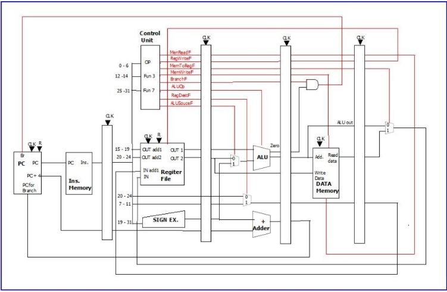
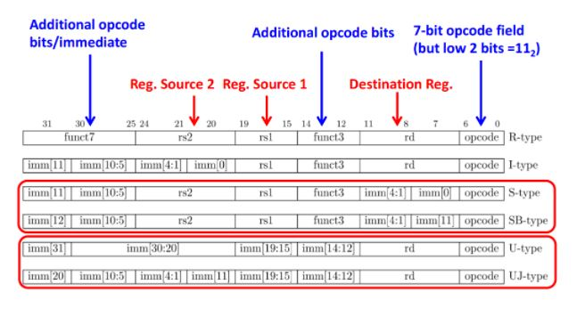
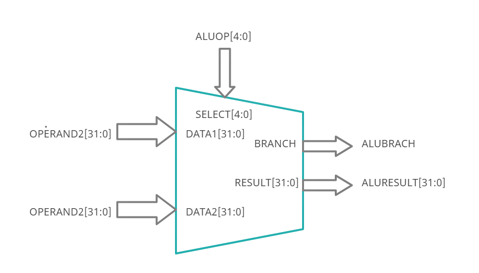

# RISCV Pipeline Proccesor Impementation

## Team
-  E/16/319, Vindula Rathnayke, [email](mailto:name@email.com)
-  E/16/320, Subhash Rathnayke, [email](mailto:name@email.com)

## Table of Contents
1. [Introduction](#introduction)
2. [Pipeline Diagram](#pipeline-diagram-with-datapath)
3. [Instruction Encoding System](#instruction-encoding-system)
4. [Units](#units)
5. [Links](#links)

## Introduction

This is Advance Computer Architecture project of implementing Piplined Proccesor according to the 32bit  RISC-V Instruction set. There containing all type of instructions.

## Pipeline Diagram with Datapath

   ### Control Signals
   - Register Read Flag
   - Register write Flag
   - Memory to register Flag
   - Memory write Flag
   - Branch Flag
   - ALU opcode
   - Register destination Flag
   - ALU source Flag

## Instruction Encoding System

## Units

1. [ALU](#alu)
2. [Control Unit](#control-unit)
3. [Register file](#register-file)

### ALU
####Design

#### ALU OP codes

| ALUOP[4:0] |	RESULT[31:0]	| BRANCH |
| ---:       |     :---:      |   ---: |
| 00000   	 |  RES_ADD	      |    0   |
| 00001	|RES_SLL	|0|
| 00010	|RES_SLT	|0|
| 00011	|RES_SLTU	|0|
| 00100	|RES_XOR	|0|
| 00101	|RES_SRL	|0|
| 00110	|RES_OR	|0|
| 00111	|RES_AND	|0|
| 01000	|0	|BR_BEQ|
| 01001	|0	|BR_BNE|
| 01010	|0	|0|
| 01011	|0	|0|
| 01100	|0	|RES_BLT|
| 01101	|0	|RES_BGE|
| 01110	|0	|RES_BLTU|
| 01111	|0	|RES_BGEU|
| 10000	|RES_SUB	|0|
| 10001	|RES_FWD	|1|
| 10010	|0	|0|
| 10011	|0	|0|
| 10100	|0	|0|
| 10101	|0	|0|
| 10110	|0	|0|
| 10111	|0	|0|
| 11000	|RES_MUL	|0|
| 11001	|RES_MULH	|0|
| 11010	|RES_MULHSU	|0|
| 11011	|RES_MULHU|	0|
| 11100	|RES_DIV	|0|
| 11101	|RES_REM	|0
| 11110	|RES_FWD	|0
| 11111	|RES_REMU	|0

.....

## Links

- [Project Repository](https://github.com/cepdnaclk/{{ page.repository-name }}){:target="_blank"}
- [Project Page](https://cepdnaclk.github.io/{{ page.repository-name}}){:target="_blank"}
- [Department of Computer Engineering](http://www.ce.pdn.ac.lk/)
- [University of Peradeniya](https://eng.pdn.ac.lk/)

[//]: # (Please refer this to learn more about Markdown syntax)
[//]: # (https://github.com/adam-p/markdown-here/wiki/Markdown-Cheatsheet)

