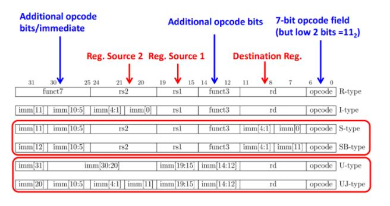

[comment]: # "This is the standard layout for the project, but you can clean this and use your own template"

# RISCV Pipeline Proccesor Impementation

---

This is a sample image, to show how to add images to your page. To learn more options, please refer [this](https://projects.ce.pdn.ac.lk/docs/faq/how-to-add-an-image/)

## Team
-  E/16/319, Vindula Rathnayke, [email](mailto:name@email.com)
-  E/16/320, Subhash Rathnayke, [email](mailto:name@email.com)

## Table of Contents
1. [Introduction](#introduction)
2. [Pipeline Diagram](#pipeline-diagram-with-datapath)
3. [Instruction Encoding System](#instruction-encoding-system)
4. [Links](#links)

---

## Introduction

This is Advance Computer Architecture project of implementing Piplined Proccesor according to the 32bit  RISC-V Instruction set. There containing all type of instructions.

## Pipeline Diagram with Datapath

   ### Control Signals
   - Register Read Flag
   - Register write Flag
   - Memory to register Flag
   - Memory write Flag
   - Branch Flag
   - ALU opcode
   - Register destination Flag
   - ALU source Flag

## Instruction Encoding System

.....

## Links

- [Project Repository](https://github.com/cepdnaclk/{{ page.repository-name }}){:target="_blank"}
- [Project Page](https://cepdnaclk.github.io/{{ page.repository-name}}){:target="_blank"}
- [Department of Computer Engineering](http://www.ce.pdn.ac.lk/)
- [University of Peradeniya](https://eng.pdn.ac.lk/)

[//]: # (Please refer this to learn more about Markdown syntax)
[//]: # (https://github.com/adam-p/markdown-here/wiki/Markdown-Cheatsheet)
